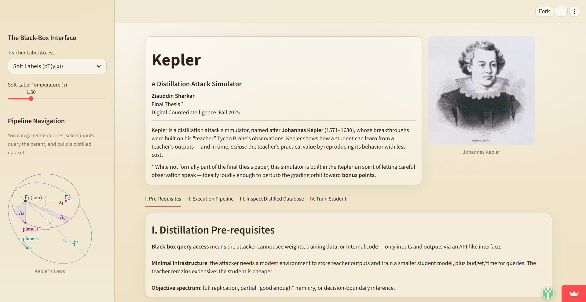
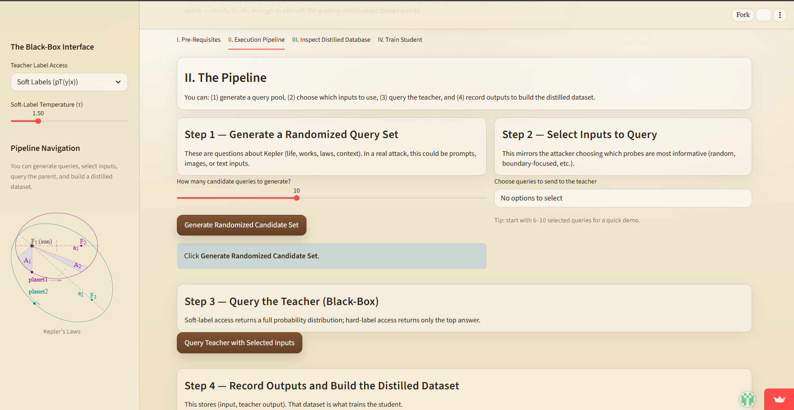
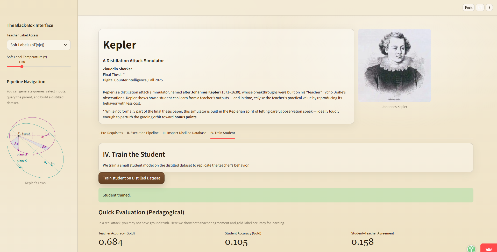
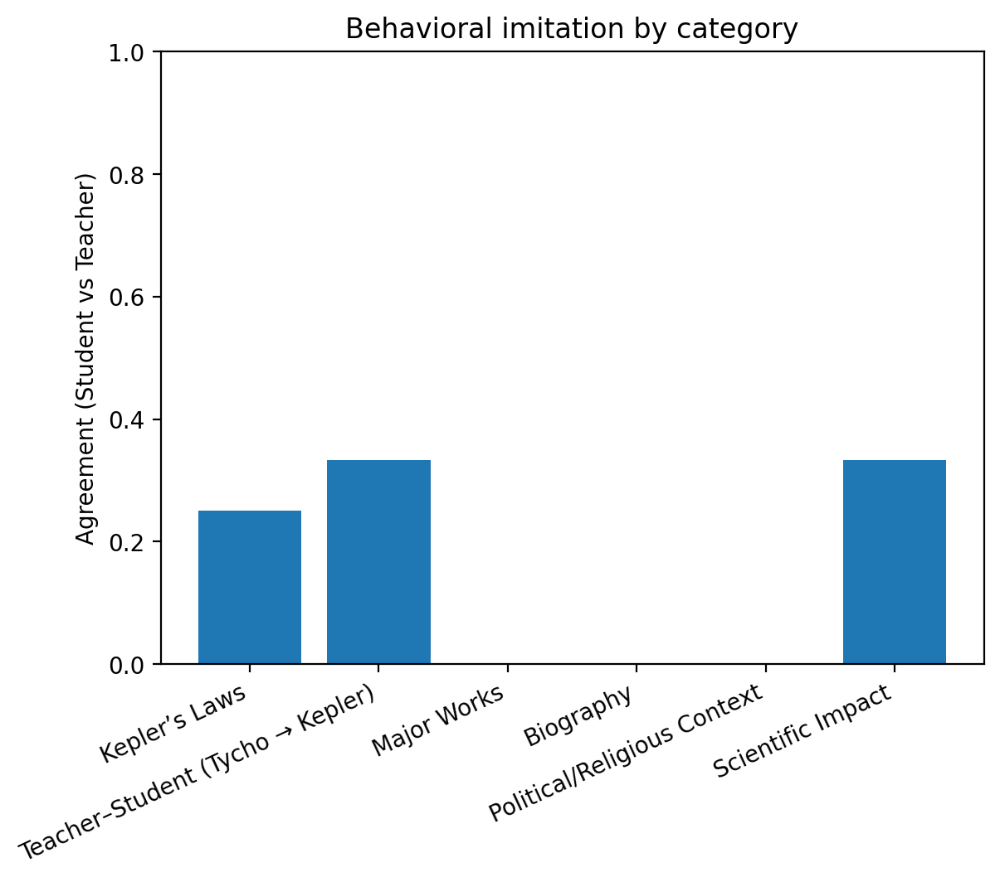

# Kepler

**Kepler** is a small Streamlit simulator that explains the basics of a knowledge distillation attack, also known as a model extraction attack.

The live demo is here: [kepler-jkjcyz83egxzgm3em3yjh3.streamlit.app](https://kepler-jkjcyz83egxzgm3em3yjh3.streamlit.app/)

## What This Project Shows

In a distillation attack, an attacker repeatedly queries a target model, records the target model's outputs, and uses those outputs to train a cheaper student model. The student does not need access to the teacher model's weights, training data, or source code. It only learns from input-output behavior.

Kepler turns that idea into a simple interactive demo:

- A hidden teacher model answers questions about Johannes Kepler.
- The user generates and selects queries, like an attacker choosing probes for a black-box model.
- The teacher returns either soft labels, which include probability-like confidence values, or hard labels, which include only the top answer.
- Those outputs are saved into a distilled dataset.
- A smaller student model is trained on the distilled dataset.
- The app compares the student against the teacher to show how behavioral imitation can emerge.

This is a teaching simulator, not an attack tool. It uses a small local scikit-learn classifier and a toy historical dataset so the mechanics are visible and safe to explore.

## Screenshots

### Overview



### Distillation Pipeline



### Student Training and Evaluation



### Behavioral Imitation Chart



## Why Distillation Attacks Matter

Knowledge distillation began as a useful machine learning technique: a large teacher model can transfer behavior to a smaller student model. In normal settings, this helps compress models and reduce cost.

The same idea becomes a security problem when a proprietary model is used without permission as the teacher. If an attacker can query the model enough times, the attacker may be able to build a student model that reproduces important parts of the teacher's behavior at much lower cost.

The basic attack pipeline is:

1. Generate or collect inputs to probe the teacher model.
2. Query the teacher through a black-box interface.
3. Record the teacher's outputs as labels.
4. Train a student model on those input-output pairs.
5. Repeat the loop until the student behaves similarly enough to the teacher.

Soft-label access is especially informative because it reveals more than the top answer. It can show the teacher's confidence distribution across possible answers, which gives the student richer training signals.

## Defensive Ideas Covered by the Demo

The app is intentionally simple, but it introduces several ideas behind real defenses:

- Limiting what the model returns, such as giving hard labels instead of full probabilities.
- Detecting unusual query behavior, especially repeated probing of decision boundaries.
- Watching for synthetic or out-of-distribution inputs.
- Recognizing the tradeoff between model usefulness and model protection.

These defenses can raise the cost of extraction, but they are difficult to make perfect without also harming legitimate users.

## Tech Stack

- [Streamlit](https://streamlit.io/) for the interactive app
- [scikit-learn](https://scikit-learn.org/) for the toy teacher and student models
- [NumPy](https://numpy.org/) for probability handling
- [Matplotlib](https://matplotlib.org/) for the evaluation chart

## Run Locally

```bash
pip install -r requirements.txt
streamlit run app.py
```

Then open the local Streamlit URL shown in your terminal.

## Repository Structure

```text
.
├── app.py
├── requirements.txt
├── assets/
│   ├── kepler_laws_diagram.svg
│   ├── kepler_portrait.webp
│   └── screenshots/
└── README.md
```

## Notes

This repository intentionally excludes private paper drafts, thesis exports, and personal research documents. The README summarizes the project in plain language without requiring the original paper.
